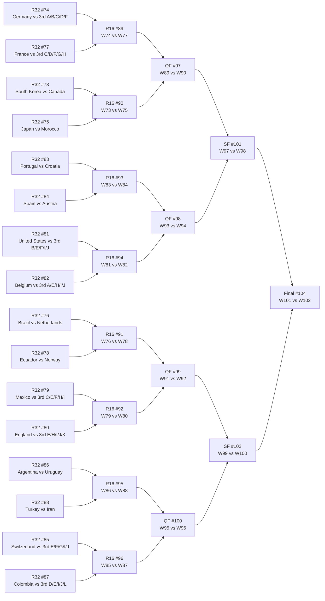

# Knockout bracket

Empty for now: teams are projected (current most-likely qualifier per slot) and fill in with real teams as the group stage finishes and with winners as knockout matches are played.

<!-- WC26:AUTO:bracket START -->

<!-- WC26:AUTO:bracket END -->
